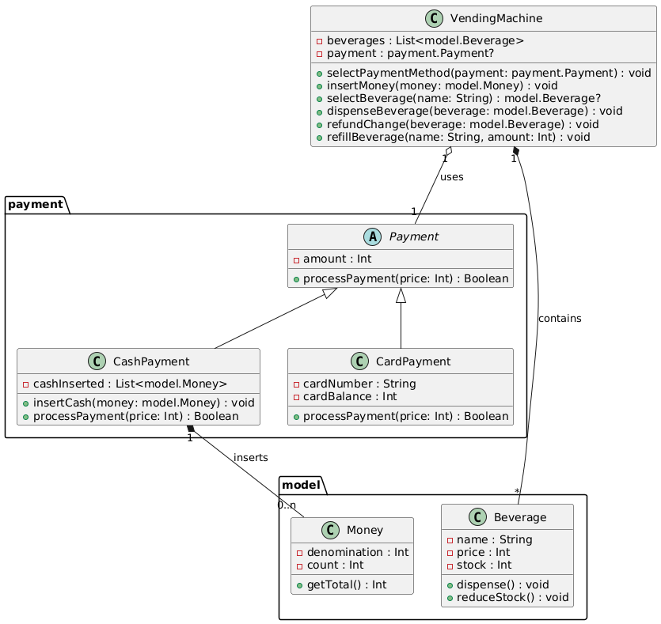
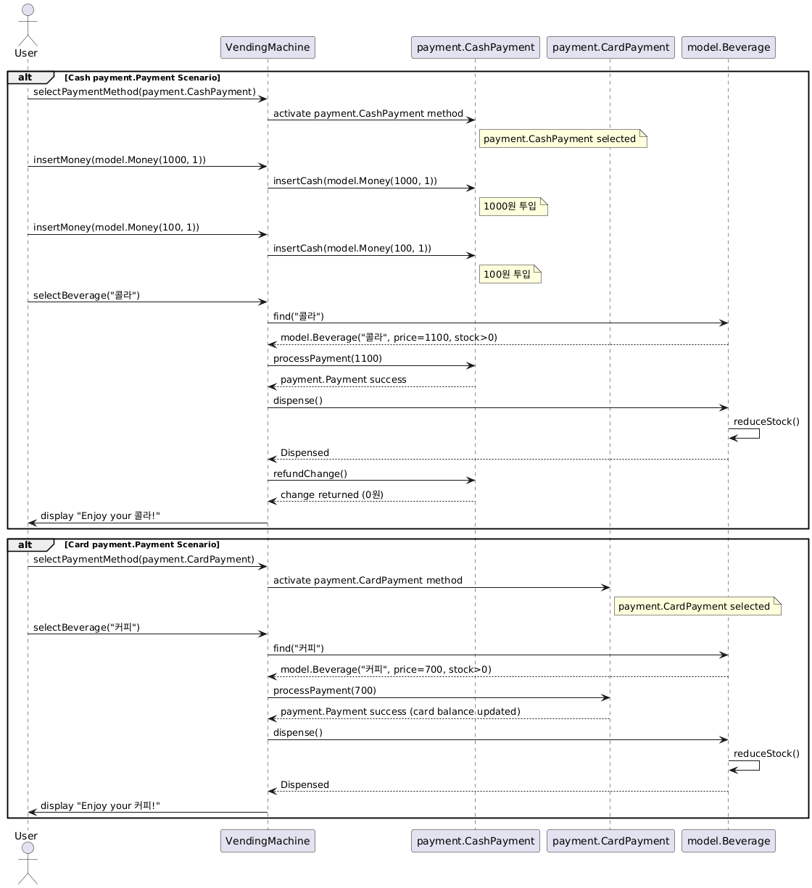

## Vending Machine

1. 자판기에서 사용자가 원하는 음료수를 얻기까지의 메카니즘의 다이어그램을 그려봅니다. (자율양식)
   - Class Diagram
   - Sequence Diagram
2. (1) 에서 작성한 주요로직을 프로그래밍 언어로 표현합니다 (자율양식)
   - Kotlin with Kotest Behavior Spec

### Class Diagram

### Sequence Diagram

